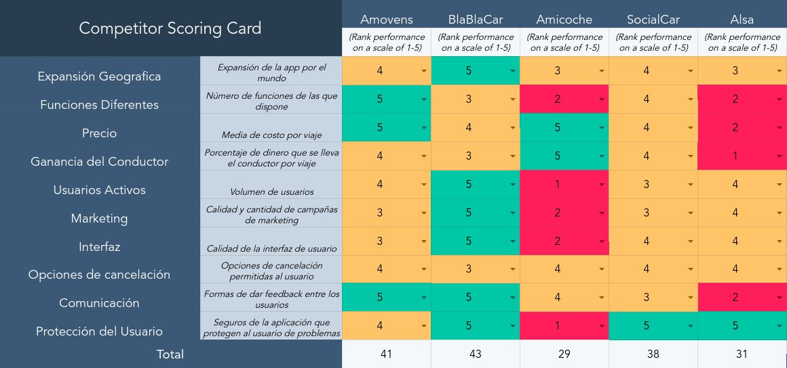
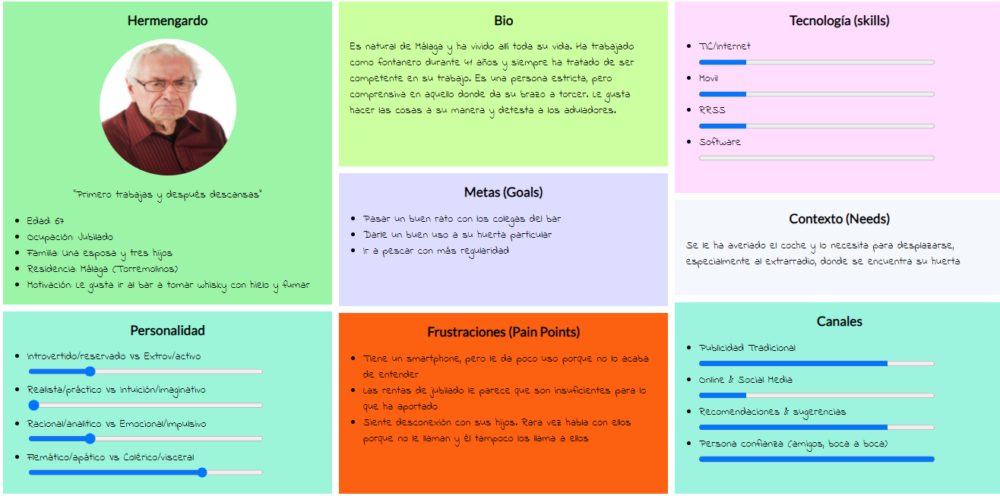
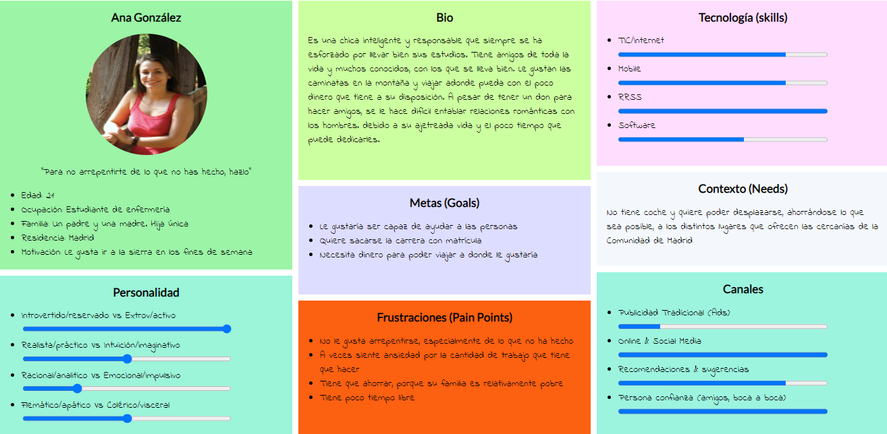
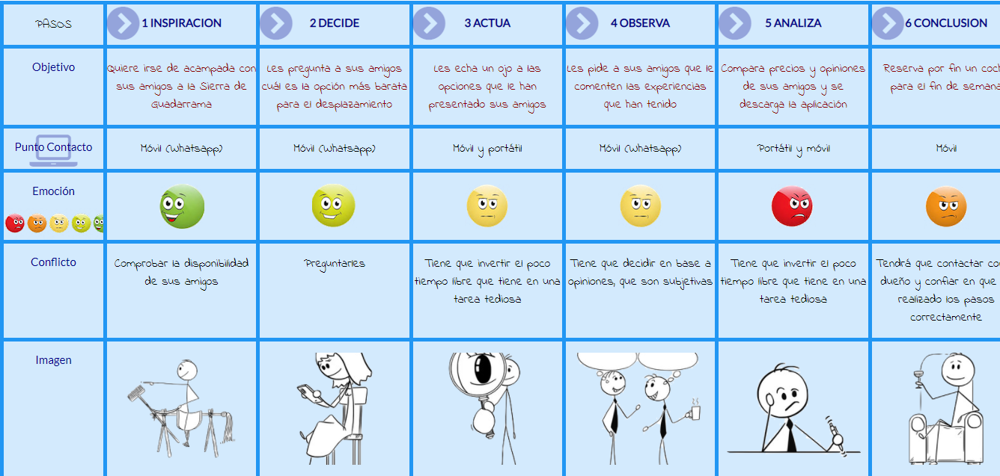

## DIU - Practica1, entregables

## Paso 1. UX Desk Research & Analisis 

 1.a Competitive Analysis
-----

Hemos elegido para hacer el Analisis de Competidores las siguientes aplicaciones de gestión de viajes compartidos:
 - Amovens, BlaBlaCar, Amicoche, SocialCar y Alsa.
Estas aplicaciones permiten al viajero comprar una plaza de un viaje propuesto y algunas incluyen más funciones.
Finalmente hemos escogido Amovens para hacer su Análisis.

 - Vemos como Amovens es un aplicación bastante completa pero que no llega a ser la mejor en su ámbito, por esto
 mismo la hemos elegido.

 - Amicoche queda con una puntuación baja ya que esta nació poco después que BlaBlaCar con un modelo denegocio 
 parecido, en cambio este nacimiento nació frustrado porque prácticamente no tiene usuarios a día de hoy.

 - Alsa es una buena alternativa, en cambio no obtiene tanta puntuación porque no se adapta tan bien al campo de 
 estudio del análisis, es una aplicación que se basa en un modelo más tradicional como son los autobuses.
 
 - BlaBlaCar es la reina de este tipo de aplicaciones porque fue la que inició este modelo de negocio y es la 
 más reconocida en este ámbito, aunque pierde en algunos punto contra Amovens (sobre todo en la ganancia del 
 conductor por cada viaje publicado).
 
 - SocialCar basa su modelo más en el alquiler de coches, no compartir viaje.
 

 1.b.1 Persona1
-----

Hemos tomado a Hermengardo como una persona dentro de nuestro análisis para contemplar el sector de mercado 
de personas menos acostumbradas a la tecnología, entre las cuales se suelen encontrar los jubilados y en 
general personas de la tercera edad.

 1.b.2 Persona2
-----

Hemos tomado a Ana González, en cambio, para darle representatividad al grupo más numeroso de gente más 
curtida en el uso de los smartphones y redes sociales,  que suele estar compuesto por personas relativamente 
jóvenes y activas.

 1.c.1 Journey1
----

Dentro del universo de pasos que puede realizar Hermengardo, hemos tomado los que vienen representados en 
el  como uno de los flujos más usuales que puede tomar una persona que tiene las características de Hermengardo.

 1.c.2 Journey2
----

En el caso de Ana González, seguimos también el patrón que esperamos que una muchacha joven siga para darle 
uso a la aplicación.

 1.d Usability Review
----

 - [Usability Review](https://github.com/gonzalodelatorree/DIU21/blob/master/P1/UsabilityReview.pdf)
 - Valoración final (numérica): 83. 
 - Según nuestra opinión, la puntuación sería algun punto más baja de lo que ha salido en el analisis de Usabilidad,
  pero creemos que la calificación, aunque está un poco por encima de lo que pensamos, es bastante acertada.
  
   - Amovens es una gran aplicación de alquiler y viajes compartidos. Además tiene gran proyección y pueden hacerse en 
     ella algunas mejoras. En particular, la parte más mejorable nos parece la ayuda que ofrece la aplicación, 
     basicamente porque según mi experiencia de uso, me ha costado encontrar ese apartado de soporte de dudas.
     Creo que esto sucede ya que, después de buscar unos minutos, encontré el apartado de ayuda en el la parte de
     "Cuenta", esto no me parece lo más adecuado, yo lo pondría en un hueco del menu de inicio de la App.
  
   - Además, también podemos ver un problema de pasos a seguir al buscar un viaje compartido. En el caso de 
     que tengamos un error al introducir un dato y le demos a continuar, después nos daremos cuenta del error
     y tendremos que volver a iniciar el proceso completo, esto puede causar incomodidad al usuario.
     
   - Por lo tanto nosotros le daríamos 78 puntos de valoración, algo menos que el resultado del análisis.
