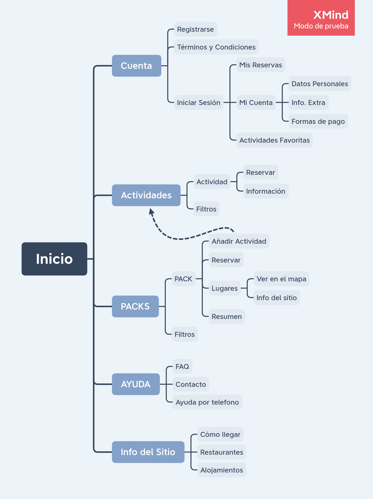

## DIU - Practica2, entregables

### Ideación 
* Malla receptora de información 
* Mapa de empatía
* Point of View 

### PROPUESTA DE VALOR
* ScopeCanvas

### TASK ANALYSIS

En nuestra aplicación hay 3 tipos de usuarios que destacan:

* GRUPO 1: a este grupo pertenecen usuarios que viven por la zona del geoparque y de vez en cuando hacen alguna actividad individual de las disponibles.

* GRUPO 2: este tipo de persona vive en España y en alguna escapada a la zona de Granada reservan alguna actividad en concreto o un pack completo.

* GRUPO 3: este grupo esta formado por personas extranjeras que vienen a Andalucía para hacer turismo en varios sitios distintos por lo tanto reservan packs de actividades.

Por lo tanto como tenemos 3 tipos de usuarios bien marcados, vamos a hacer el analisis de tareas con una Task Matrix.

Los valores de la tabla según el uso de la funcion son: High(H), Medium(M), Low(L)

|TAREAS|GRUPO 1|GRUPO 2|GRUPO 3|
|------------------------------|:------:|:------:|:------:|
|Registrarse|L|L|L|
|Iniciar Sesion|H|M|M|
|Mostrar Actividad|H|M|M|
|Mostrar Pack|M|M|H|
|Reservar Actividad|H|M|L|
|Reservar Pack|L|M|H|
|Ver información sobre el sitio|L|M|H|
|Ver Resumen y precio de la Actividad|H|M|L|
|Ver Resumen y precio del pack|L|M|H|
|Consultar FAQ|L|L|L|
|Pedir ayuda por teléfono|L|L|M|
|Ver los términos y condiciones|L|L|L|
|Consultar "Mis Reservas"|M|M|M|
|Cancelar reserva|M|L|L|

### ARQUITECTURA DE INFORMACIÓN

* Sitemap 

* Labelling 

|Label|Descripción|
|---------------------|--------------------------------------|
|Cuenta|Sección que lleva a la cuenta del usuario|
|Registrarse|Método para registar un nuevo usuario|
|Terminos y condiciones|Visualización de los términos y condiciones de la aplicación|
|Iniciar Sesión|Método para que un usuario inicie sesión|
|Mis Reservas|Sección en la que el usuario puede ver sus reservas|
|Mis datos|Sección en la que el usuario puede ver sus datos|
|Actividades Favoritas|Actividades marcadas como favoritas por el usuario|
|Datos Personales|Muestralos datos personasles del usuario|
|Info. Extra|Muestra información extra sobre el usuario|
|Actividades|Sección en la que se puede realizar la reserva de actividades|
|Actividad|Actividad individual que el usuario puede reservar|
|Reservar|Reserva la actividad para el usuario|
|Información|Muestra información de la actividad|
|Filtros|Apartado de filtros que el usuario puede seleccionar para que se le muestren las actividades más acordes|
|PACKS|Sección de reserva de packs|
|PACK|Conjunto de visitas y actividades que el usuario puede reservar|
|Añadir Actividad|Añade una actividad a un pack|
|Reservar|Reserva el pack para el usuario|
|Lugares|Lugares que sé visitarán al elegir este pack|
|Ver en el mapa|Visualización mediante un mapa del lugar que se va a visitar|
|Info del sitio|Información del lugar que se va a visitar|
|Resumen|Resumen del viaje que muestra la planificación de las actividades en orden cronológico y por días|
|Filtros|Apartado de filtros que el usuario puede seleccionar para que se le muestren los packs más acordes|
|Ayuda|Sección de ayuda al usuario|
|FAQ|Sección de preguntas frecuentes|
|Contacto|Muestra varias opciones de contacto con la organización|
|Ayuda por teléfono|Teléfono de ayuda al cliente|
|Información|Sección de información sobre  el Geoparque|
|Cómo llegar|Muestra un mapa de la situación geográfica del Geoparque|
|Restaurantes|Muestra restaurantes/bares cercanos al Geoparque bien valorados|
|Alojamientos|Muestra alojamientos cercanos al Geoparque bien valorados|

### Prototipo Lo-FI Wireframe 

### Conclusiones  
(incluye valoración de esta etapa)
