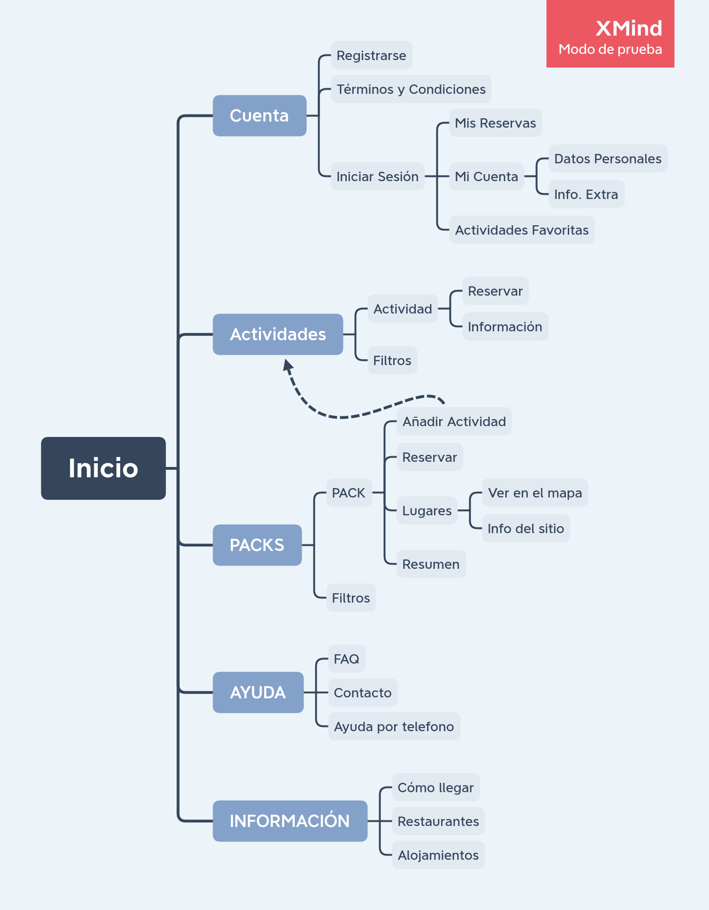

## DIU - Practica2, entregables

### Ideación 
* Malla receptora de información 
* Mapa de empatía
* Point of View 

### PROPUESTA DE VALOR
* ScopeCanvas

### TASK ANALYSIS

En nuestra aplicación hay 3 tipos de usuarios que destacan:

* GRUPO 1: a este grupo pertenecen usuarios que viven por la zona del geoparque y de vez en cuando hacen alguna actividad individual de las disponibles.

* GRUPO 2: este tipo de persona vive en España y en alguna escapada a la zona de Granada reservan alguna actividad en concreto o un pack completo.

* GRUPO 3: este grupo esta formado por personas extranjeras que vienen a Andalucía para hacer turismo en varios sitios distintos por lo tanto reservan packs de actividades.

Por lo tanto como tenemos 3 tipos de usuarios bien marcados, vamos a hacer el analisis de tareas con una Task Matrix.

Los valores de la tabla según el uso de la funcion son: High(H), Medium(M), Low(L)

|TAREAS|GRUPO 1|GRUPO 2|GRUPO 3|
|:------------------------------:|:------:|:------:|:------:|
|Registrarse|L|L|L|
|Iniciar Sesion|H|M|M|
|Mostrar Actividad|H|M|M|
|Mostrar Pack|M|M|H|
|Reservar Actividad|H|M|L|
|Reservar Pack|L|M|H|
|Ver información sobre el sitio|L|M|H|
|Ver Resumen y precio de la Actividad|H|M|L|
|Ver Resumen y precio del pack|L|M|H|
|Consultar FAQ|L|L|L|
|Pedir ayuda por teléfono|L|L|M|
|Ver los términos y condiciones|L|L|L|
|Consultar "Mis Reservas"|M|M|M|
|Cancelar reserva|M|L|L|

### ARQUITECTURA DE INFORMACIÓN

* Sitemap 

* Labelling 

### Prototipo Lo-FI Wireframe 

### Conclusiones  
(incluye valoración de esta etapa)
