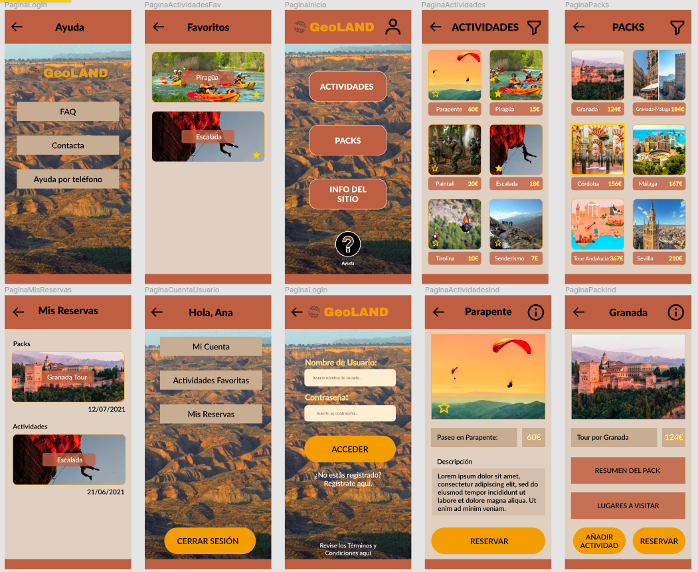

# DIU - Practica 3, entregables

## Moodboard (diseño visual + logotipo)   

## Landing Page

## Mockup: LAYOUT HI-FI

Realizamos diferentes mockups para visualizar cómo se mostraría el producto final. Para ello hemos utilizado la herramienta Figma. Es un software online que permite 
realizar todo tipo de diseños y además provee una funcionalidad para hacerlos interactivos. Nos ha resultado de gran ayuda, ya que con su parte gratuita (también es de pago) hemos podido realizar lo que queríamos sin problema, además de que es bastante intuitiva y agrabadble de usar.

MockUps:

Vídeo mostrando los diseños de forma interactiva:

## Documentación: Publicación del Case Study

Hemos realizado un video-presentación comentando brevemente el desarrollo de nuestro proyecto:

La realización del video presentación ha sido llevada a cabo mediante la herramienta online Canva (con versión gratuita y muy cómoda y facil de usar) y el montaje del vídeo ha sido con Adobe Premiere.

 - Como valoración final, podemos decir que nos ha resultado una práctica realmente entretenida, aunque la que más tiempo nos ha llevado (por todo el trabajo de diseño que hay que realizar). La parte que ha resultado probablemnte más engorrosa han sido los Guidelines por su parte de investigación de diferentes lineas de estilos: en cambio, la realización de Landing Page y Mockups ha sido (aunque costosa en niveles de tiempo) más entretenida.
 
