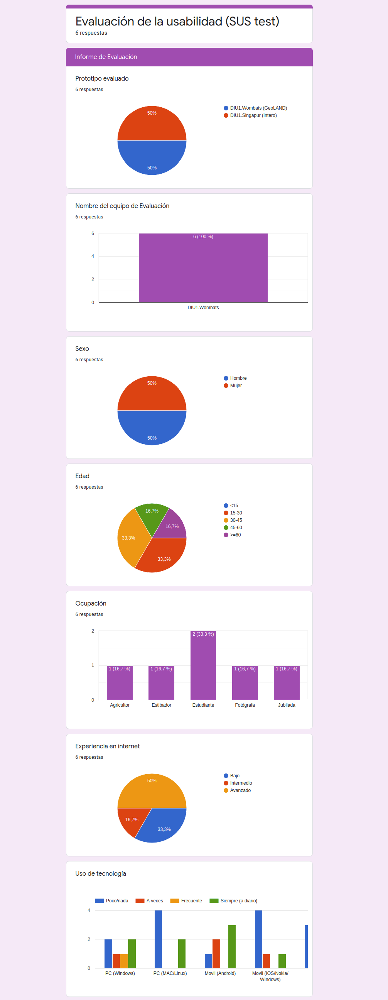

# DIU21
Prácticas Diseño Interfaces de Usuario 2020-21 (Tema: Turismo) 

Grupo: DIU1_Wombats.  Curso: 2020/21 
Updated: 8/2/2021

Proyecto: GeoLAND

Descripción: aplicación desarrollada para que los usuarios puedan gestionar y planificar su visita a la provincia de Granada y Andalucía y así conseguir incentivar el turismo rural y local.

Logotipo: 

Miembros
 * :bust_in_silhouette:   [Gonzalo de la Torre Martínez](https://github.com/gonzalodelatorree) :octocat:     
 * :bust_in_silhouette:   [Diego Alfonso Candelaria Rodríguez](https://github.com/dcandelaria) :octocat:

----- 

# Proceso de Diseño 

## Paso 0. Motivación del proyecto. 

En la provincia de Granada existe un territorio espectacular por su paisaje y por albergar uno de los mejores registros geológicos continentales de los últimos 5 millones de años. Entre otros tesoros, este registro contiene el más completo conjunto de restos fósiles de los grandes mamíferos ya extinguidos que vivieron durante el Periodo Cuaternario (los últimos 2,5 millones de años de la historia de la Tierra, cuando apareció la humanidad sobre el planeta).

A este territorio espectacular se le ha llamado Geoparque de Granada. En este lugar podemos realizar actividades varias como talleres de ciencia, agricultura, historia... además de deportes al aire libre como paintball, escalada, piragüismo, paramente y muchas más.

Por lo tanto vemos necesario la aparición de nuestro proyecto software que nace para gestionar las actividades en el recién implantado Geoparque de Granada. Nuestra aplicación móvil facilitará a los usuarios realizar planificación (y reserva) de actividades. Tambíen proveerá información sobre el sitio y opciones para planificar los viajes más allá del Geoparque. Por ejemplo se podrán reservar packs de actividades en el geoparque y estos packs incluirán visitas a otras zonas de andalucía como La Alhambra, Mezquita de Córdoba...

En definitiva, esta aplicación será un incentivo para el turismo en la provincia y nuestra comunidad autónoma ya que ofrece mucha sencillez y comodidad para poder visitar la zona.

## Paso 1. UX Desk Research & Analisis 

 1.a Competitive Analysis
-----

Hemos elegido para hacer el [analisis de competidores](https://github.com/gonzalodelatorree/DIU21/blob/master/P1/CompetitiveAnalysis.png) las siguientes aplicaciones de gestión de viajes compartidos:
 - Amovens, BlaBlaCar, Amicoche, SocialCar y Alsa.
Estas aplicaciones permiten al viajero comprar una plaza de un viaje propuesto y algunas incluyen más funciones.
Finalmente hemos escogido Amovens para hacer su Análisis.

 1.b.1 Persona Ficticia (Hermengardo)
-----

Hemos tomado a [Hermengardo](https://github.com/gonzalodelatorree/DIU21/tree/master/P1/Persona1.png) como una persona dentro de nuestro análisis para contemplar el sector de mercado de personas menos acostumbradas a la tecnología, 
entre las cuales se suelen encontrar los jubilados y en general personas de la tercera edad.

 1.b.2 Persona Fictica (Ana)
-----

Hemos tomado a [Ana González](https://github.com/gonzalodelatorree/DIU21/tree/master/P1/Persona2.png), en cambio, para darle representatividad al grupo más numeroso de gente más curtida en el uso de los smartphones y redes sociales, 
que suele estar compuesto por personas relativamente jóvenes y activas.

 1.c.1 Journey Map (Hermengardo)
----

Dentro del universo de pasos que puede realizar Hermengardo, hemos tomado los que vienen representados en el [Journey Map](https://github.com/gonzalodelatorree/DIU21/tree/master/P1/Journey1.png) como uno de los flujos 
más usuales que puede tomar una persona que tiene las características de Hermengardo.

 1.c.2 Journey Map (Ana)
----

En el caso de Ana González ([Journey Map](https://github.com/gonzalodelatorree/DIU21/tree/master/P1/Journey2.png)), seguimos también el patrón que esperamos que una muchacha joven siga para darle uso a la aplicación.

 1.d Usability Review
----

 - [PDF de Revisión de Usabilidad](https://github.com/gonzalodelatorree/DIU21/blob/master/P1/UsabilityReview.pdf) (Amovens)
 - Valoración final (numérica): 83. 
 - Según nuestra opinión, la puntuación sería algun punto más baja de lo que ha salido en el   analisis de Usabilidad, pero creemos que la calificación, aunque está un poco por encima de lo que pensamos, es bastante acertada.

## Paso 2. UX Design  

 2.a Herramientas de análisis (ideación)
----

Hemos elaborado diagramas de tipo Feedback Grid, Empathy Map y Points of View, para que nos permitiesen valorar con mayor acierto el ámbito de análisis de usuarios a los que nos circunscribimos. Los diagramas se encuentran [aquí](https://github.com/gonzalodelatorree/DIU21/tree/master/P2#ideación).

 2.b ScopeCanvas
----
Realizamos un Scope Canvas para mostar la propuesta de valor de nuestro el proyecto. Su plasmación en un diagrama se encuentra [aquí](https://github.com/gonzalodelatorree/DIU21/tree/master/P2#propuesta-de-valor). 

 2.b Tasks analysis 
-----

Un User map es un diagrama que nos muestra los pasos que sigue un cliente durante su relación con un servicio o empresa. Por su parte, un Task Flow es un diagrama que muestra el trayecto lógico que debe realizar un usuario para realizar una tarea determinada.

La diferencia entre ellos es que el primero se basa en la relación del cliente con un producto y el segundo en la relación del cliente con un proceso determinado.

Nosotros hemos realizado una [Task Matrix](https://github.com/gonzalodelatorree/DIU21/tree/master/P2#task-analysis).

 2.c Arquitectura de información (Sitemap y Labelling) 
----

Un SiteMap es un grafo que muestra la jerarquía y relaciones de las diferentes pantallas de un sitio web o aplicación. El labelling o etiquetado es la manera en la que asociamos una palabra o icono con su significado o función que realiza. En nuestro caso sirve para mejorar el diseño de nuestras aplicaciones o sitios web (por ejemplo nosotros asociamos un icono de una interrogación al apartado de ayuda de la app).

Nuestro [SiteMap y Labelling](https://github.com/gonzalodelatorree/DIU21/tree/master/P2#arquitectura-de-informaci%C3%B3n).

 2.d Wireframes
-----

Para hacer un primer acercamiento al diseño de la app realizamos diferentes [Wireframes](https://github.com/gonzalodelatorree/DIU21/tree/master/P2#prototipo-lo-fi-wireframe).

## Paso 3. Mi UX-Case Study (diseño)

 3.a Moodboard
-----

Gracias a www.canvas.com hemos realizado el mooodboard. Como nuestra aplicación está relacionada con actividades de carácter campestre hemos utilizados colores apropiados para ello, como el marrón o el naranja. Hemos usado una tipografía sencilla el logotipo ha sido creado también con las mismas directrices. Aquí el moodboard:

[Moodboard](P3/mood.jpg)

  3.b Landing Page
----

Para la landing page hemos hecho uso de Google Sites. Hemos incorporado los colores presentes en la paleta de colores del moodboard; además hemos incorporado nuestro vídeo de presentación y un link de descarga de la aplicación, que estaría en la App Store. Aquí el enlace:

[Web GeoLAND](https://sites.google.com/view/diu1wombats/startseite)

 3.c Guidelines
----

El diseño visual de la aplicación sigue unas directrices respecto de unos patrones estándares para interfaces de usuario que hemos incorporado de la página web http://ui-patterns.com/. A continuación detallamos aquellos que hemos implementado:

 **Input prompt**
En la página de acceso a la cuenta del usuario los espacios a rellenar del usuario y la contraseña han sido debidamente complementados con texto de fondo para indicar con claridad la información que debe ser introducida por el usuario.

**Undo**
Cada página lleva integrado un botón en la esquina superior izquierda de la pantalla para retroceder a  la página anterior en la que el usuario se encontraba.

**Categorization**
Para el acceso a las actividades, han sido categorizadas en parapente, piraguas, paintball, escalada, etc.

**Favorites**
El usuario puede guardar en favoritos las actividades que le interesen para acceder más tarde mientras ojea las actividades que tiene a su disposición.

**Frequently asked questions**
Se ha incluido una sección dentro de “Ayuda” para que el usuario pueda acceder a las preguntas más frecuentes sobre el sitio.

**ProductPage**
Para los productos que se ofertan en la aplicación, en nuestro caso actividades, se incluyen una imagen descriptiva, una descripción acorde y un precio acompañante.

### Guidelines
Hemos usado colores rupestres: distintos matices de marrón, naranja y negro. Esta elección viene justificada por las características de las actividades que proporciona la aplicación, pues están todas ellas orientadas al aire libre, donde predomina especialmente el color marrón asociado a la tierra; así os usuarios, de manera subconsciente, estarán predispuestos al contenido que se les ofrece.

La iconografía que se ha utilizado es de diseño simple y autodescriptiva para aligerar el peso mental que los usuarios que navegan por la aplicación pueden llegar a tener.

Se ha procurado mantener contrastes entre colores para facilitar la accesibilidad a los usuarios, tratando de mantener un mínimo de legibilidad en las zonas de texto presentes a los largo de la aplicación.

Las imágenes que vienen incluidas tratan de reflejar el aire campestre que tratamos de emitir, además de un componente emocional: de diversión para actividades más ligeras y de riesgo para actividades más peligrosas.

  3.d Mockup
----

Vamos a confeccionar finalmente los mockups de la aplicación móvil para saber cómo sería el producto final.
Hemos utilizado Figma, un software online que descubrimos y nos ha facilitado mucho la tarea.

Mockups y demostración interactiva [aquí](https://github.com/gonzalodelatorree/DIU21/tree/master/P3#mockup-layout-hi-fi)

 3.e Video-Presentación del proyecto.
-----

Hemos realizado un [video-presentación](https://youtu.be/h6zmi457jQ0) comentando brevemente el desarrollo de nuestro proyecto:

[Valoración final](https://github.com/gonzalodelatorree/DIU21/tree/master/P3#documentaci%C3%B3n-publicaci%C3%B3n-del-case-study)

## Paso 4. Evaluación 

 4.a Caso asignado
----

Se nos ha asignado el caso de estudio del equipo [DIU1.Singapur](https://github.com/Groctel/DIU21).

Este equipo ha desarrollado Intero, una app de economía colaborativa basada en el couchsurfing. Los usuarios ofrecen sus casas para estancias cortas a viajeros dinámicos que no quieren depender de un hotel.

 4.b User Testing
----

[Resumen Analisis de Usabilidad](https://github.com/gonzalodelatorree/DIU21/tree/master/P4)

Realizaremos un A/B testing donde:
 - A -> [GeoLAND](https://github.com/gonzalodelatorree/DIU21/tree/master/P4#caso-1) (DIU1.Wombats)
 - B -> [Intero](https://github.com/gonzalodelatorree/DIU21/tree/master/P4#caso-2) (DIU1.Singapur)
 
Hemos elegido 6 personas para que realicen el estudio de los dos casos. Las tres primeras personas serán las participantes en el test del equipo A (GeoLAND) y las tres restantes participarán en el estudio del caso B.

| Usuarios | Sexo/Edad     | Ocupación   |  Exp.TIC    | Personalidad | Plataforma | TestA/B | SUS Score
| ------------- | -------- | ----------- | ----------- | -----------  | ---------- | ---- | ------ |
| 1  | H / 31   | Estibador  | Media       | Introvertido, apurado, sorpresa | Móvil       | A | 77,5
| 2  | M / 66   | Jubilada  | Baja       | Cansada, charlatana, miedo       | Móvil        | A | 60
| 3  | H / 25   | Estudiante     | Avanzado        | Introvertido, aventurero, enfado    | Móvil      | A | 90
| 4  | M / 33   | Fotógrafa  | Avanzado       | Trabajadora, fotofílica, miedo     | Móvil        | B | 82,5
| 5  | H / 53   | Agricultor     | Baja        | Relajado, trabajador, enfado    | Móvil      | B | 60
| 6  | M / 18   | Estudiante  | Media       | Activo, deportista, alegría     | Móvil        | B | 92,5

. 4.c Cuestionario SUS
----

A continuación mostramos las respuestas de los usuarios a las preguntas (resumen) y la puntuación SUS alcanzada.

### Resultado del cuestionario SUS para GeoLAND
|    | PREGUNTAS                                                                                |  1 |  2 |  3 |
|----|------------------------------------------------------------------------------------------|:--:|:--:|:--:|
|  1 | Creo que me gustará visitar con frecuencia este website                                  |  3 |  2 |  4 |
|  2 | Encontré el website innecesariamente complejo                                            |  1 |  3 |  1 |
|  3 | Pensé que era fácil utilizar este website                                                |  4 |  3 |  5 |
|  4 | Creo que necesitaría del apoyo de un experto para recorrer el website                    |  1 |  2 |  1 |
|  5 | Encontré las funciones del website bastante bien integradas                              |  2 |  4 |  4 |
|  6 | Pensé que había demasiada inconsistencia en el website                                   |  2 |  3 |  2 |
|  7 | Imagino que la mayoría de las personas aprenderían muy rápidamente a utilizar el website |  4 |  4 |  5 |
|  8 | Encontré el website muy grande al recorrerlo                                             |  1 |  3 |  1 |
|  9 | Me sentí muy confiado en el manejo del website                                           |  4 |  4 |  4 |
| 10 | Necesito aprender muchas cosas antes de manejarme en el website                          |  1 |  2 |  1 |
|    |                                                             Valoración final (SUS Score) | 77,5 | 60 | 90 |

Podemos ver que GeoLAND tiene una buena puntuación SUS, por lo tanto, podemos decir que su usabilidad es buena, aunque 
para perfiles no tan acostumbrado a la tecnología puede ser una App más engorrosa.
Podemos destacar que los usuarios de la encuesta suponen que será una app fácil de usar para nuevos usuarios, aunque en 
contrapunto podemos ver que algunos usuarios pueden pensar que hay una ligera inconsistencia en las funciones.

### Resultado del cuestionario SUS para Intero
|    | PREGUNTAS                                                                                |  4 |  5 |  6 |
|----|------------------------------------------------------------------------------------------|:--:|:--:|:--:|
|  1 | Creo que me gustará visitar con frecuencia este website                                  |  5 |  3 |  5 |
|  2 | Encontré el website innecesariamente complejo                                            |  1 |  2 |  1 |
|  3 | Pensé que era fácil utilizar este website                                                |  5 |  3 |  5 |
|  4 | Creo que necesitaría del apoyo de un experto para recorrer el website                    |  1 |  2 |  1 |
|  5 | Encontré las funciones del website bastante bien integradas                              |  4 |  3 |  5 |
|  6 | Pensé que había demasiada inconsistencia en el website                                   |  1 |  2 |  1 |
|  7 | Imagino que la mayoría de las personas aprenderían muy rápidamente a utilizar el website |  5 |  2 |  3 |
|  8 | Encontré el website muy grande al recorrerlo                                             |  4 |  1 |  1 |
|  9 | Me sentí muy confiado en el manejo del website                                           |  5 |  2 |  5 |
| 10 | Necesito aprender muchas cosas antes de manejarme en el website                          |  4 |  2 |  2 |
|    |                                                             Valoración final (SUS Score) | 82,5 | 60 | 92,5 |

Intero también obtiene una buena puntuanción SUS y también podemos decir que es bastante usable, quizá su punto más débil
puede ser que a algunos usuarios le da la sensación de que la curva de aprendizaje puede ser no muy rápida.
A favor de esta aplicación podemos destacar que a los usuarios le da la sensación de que no tiene funcionalidades demasiado
complejas.

 4.d Usability Report
----

[UsabilityReview de Intero](https://github.com/gonzalodelatorree/DIU21/blob/master/P4/Usability_Report_Intero.pdf)

Visto el trabajo que han realizado nuestros compañeros de DIU1.Intero, nos ha parecido muy buen proyecto.
Creemos que está muy limpio y bien explicado y se nota que se le ha puesto esfuerzo.

## Conclusión final / Valoración de las prácticas

Para cerrar la explicación de nuestro proyecto, nos gustaría decir que el desarrollo de estas prácticas nos ha parecido
muy interesante, ya que es la primera vez que vemos en la carrera una asignatura que se centre en el usuario.

Gracias a las prácticas y a las clases de teoría hemos podido ir viendo y aprendiendo muchos de los conceptos básicos y
herramientas que nos pueden ser útiles para poder desarrollar desde 0 una aplicación. Además el uso de GitHub para la 
exposición de nuestro proyecto nos ha parecido realmente útil tanto como para los profesores como para poder trabajar 
con nuestro compañero.

Es por todo esto que podemos decir que nos ha gustado mucho tanto el enfoque que tiene la parte práctica de la asignatura 
y como se ha llevado a cabo.

